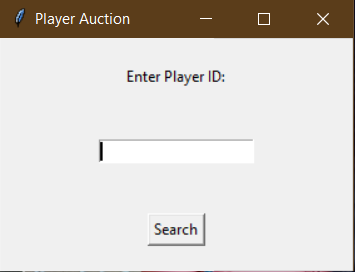
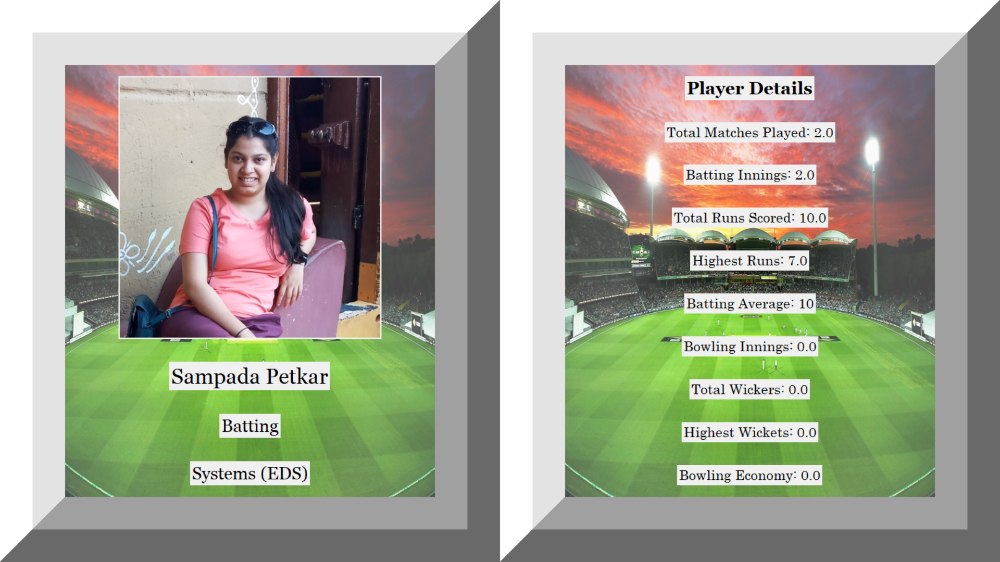

## Cricket Player Info Dashboard

A TKinter based UI to display Cricket player info, fetched from CrickHero and Forms.

It displays player Photo, name, details and cricket statistics.

A window pops up to ask to enter ID with which data will searched in given .csv file and displayed on second window.

#### Screen 1

#### Screen 2

### Requirements

* Dependencies - requirements.txt
* Python - 3:10.1
* SPL_player_data.csv - CSV file containing columns with following headers.
  * ID - row ID or player ID
  * Name - player name
  * GID - unique ID to identify a photo in /photos
  * CrickHero ID
  * skills - all rounder/bowlling/batting
  * total_match
  * bat_innings
  * total_runs
  * highest_run
  * bat_average
  * ball_innings
  * total_wickets
  * highest_wicket
  * ball_economy
* photos/ - photos to display with name as "GID"
